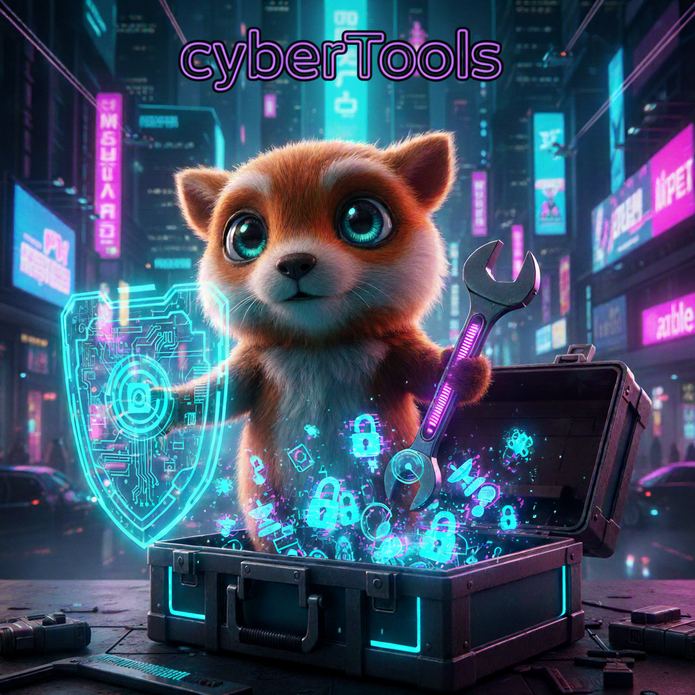
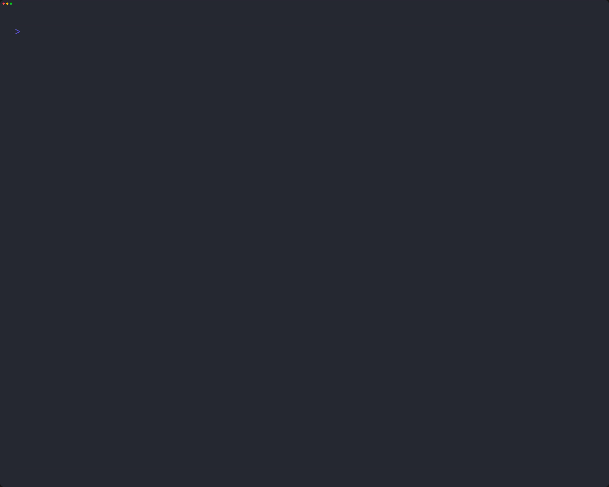
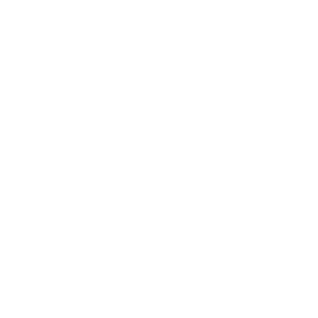

# cyberTools

  


[](https://golang.org/)
[](https://goreportcard.com/report/github.com/Quirky1869/cyberTool)
[](https://github.com/Quirky1869/cyberTools/releases)
[](https://github.com/Quirky1869/cyberTools/actions/workflows/build-and-tests.yml)

## Résumé
<p align="center">  
<a href="https://golang.org" target="_blank" rel="noreferrer">  
    
</a>  
</p>  

CyberTools est une interface utilisateur textuelle (TUI) immersive et modulaire développée en Go. Elle agit comme un hub centralisé ("Tools Box") permettant d'organiser, de naviguer et d'exécuter rapidement divers scripts et outils de cybersécurité et d'administration système.  

Construite avec l'écosystème Charm (Bubble Tea, Lipgloss), cette TUI met l'accent sur l'ergonomie :

- Navigation Fluide : Interface entièrement pilotable au clavier (flèches, tab et des touches Vim h/j/k/l).  
- Organisation par Onglets : Système de catégories ([...], [...], [...], etc.) pour classer proprement les outils.  
- Design Cyberpunk : Une identité visuelle forte avec titre ASCII Art, effets de focus lumineux et bordures stylisées.  
- Thèmes Dynamiques : Possibilité de changer l'ambiance visuelle à la volée (ex: thème Neon vs Cyberpunk) sans redémarrer le programme (t).  
- Aide Contextuelle : Barre d'aide interactive qui s'adapte selon la section active.  

## Fonctionnalités

La TUI `cyberTools` faite en [Go](https://go.dev) permet de lancés plusieurs outils utilitaires eux aussi fait en Go  

## Structure du projet  

```bash
.
├── cmd
│   └── app
│       └── main.go # Point d'entrée du programme  
├── bin
│    └──cyberTools
├── tools
│   └── definition.go
│   └── tools1.go
│   └── tools2.go
│   └── tools3.go
│   └── .........
├── ui
│   ├── keys.go
│   ├── root.go
│   └── styles.go
├── README.md  
├── _images # Dossier d'assets
├── README.md
├── go.mod
├── go.sum
└── build.sh # Script pour compiler le projet
```

## Lancement de la TUI

> [!TIP]  
Après avoir fait un `git clone https://github.com/Quirky1869/cyberTools.git` et `cd cyberTools`  
Vous pouvez lancer la TUI via le binaire dans `./bin` ou lancer la commande `go run cmd/app/main.go`  



## Releases

Les [releases](https://github.com/Quirky1869/cyberTools/releases) sont disponibles [ici](https://github.com/Quirky1869/cyberTools/releases)  

## Technologies utilisées

| Librairie                                                    | Utilisation                          |
| ------------------------------------------------------------ | ------------------------------------ |
| [Bubble Tea](https://github.com/charmbracelet/bubbletea)     | Gestion de l’interface TUI           |
| [Lipgloss](https://github.com/charmbracelet/lipgloss)        | Stylisation du texte et des bordures |
|  [Golang](https://go.dev)   | Scripts d’installation des paquets   |


## Auteur

Projet développé par Quirky  
<a href="https://github.com/Quirky1869" target="_blank">  
   GitHub  
</a>  

## Licence

Ce projet est distribué sous licence MIT  
